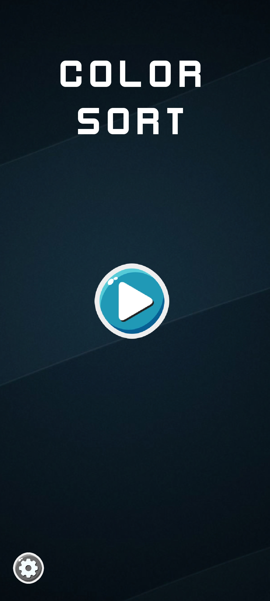
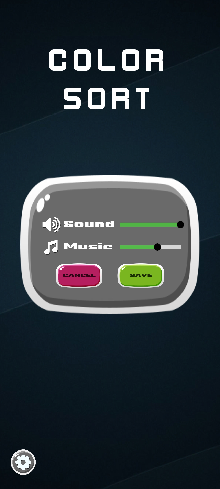
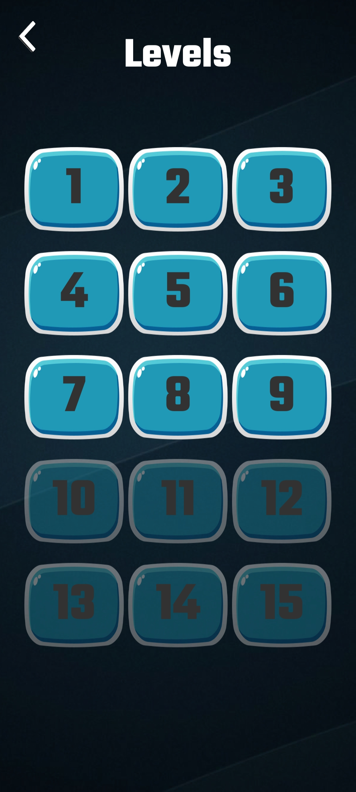
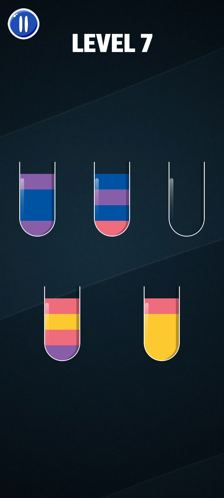

# Colorsort game
A simple Android game made with Unity enging and C#. 

## Features
- Customizabe settings
- Music and sound effects
- 15 levels
- Lightwhight and user friendly
- Easy to add extra levels and features 

## Screenshots

 
## Contribution
- Fork the repository on GitHub
- Create your feature branch: git checkout -b brach-name
- Stage your files git add .
- Commit your changes git commit -m 'comment'
- Push to the branch git push origin brach-name
- Create a new pull request

## License
MIT © 2022
